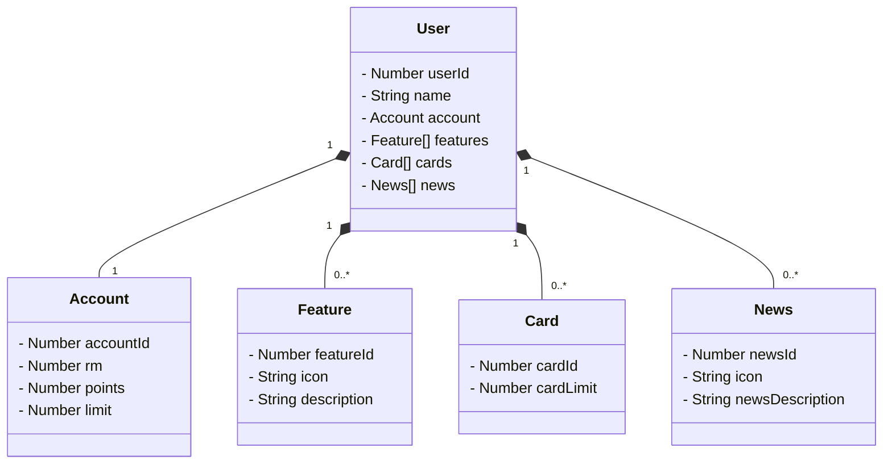

# Avanade Decola Tech 2025

Java RESTful API criada para a Avanade Decola Tech 2025.

## Principais Tecnologias

- **Java 17**: Utilizar a versão LTS mais recente do Java para aproveitar as melhorias em desempenho e segurança, mantendo a compatibilidade com bibliotecas modernas.
- **Spring Boot 3**: Usar o Spring Boot 3 para agilizar o desenvolvimento com autoconfiguração inteligente, permitindo criar aplicações robustas com menos esforço.
- **Spring Data JPA**: Simplificar a camada de persistência de dados com o Spring Data JPA, proporcionando uma integração eficiente e fluida com bancos de dados relacionais.
- **OpenAPI (Swagger)**: Documentar a API com OpenAPI (Swagger), garantindo clareza na comunicação entre desenvolvedores e facilidade na manutenção dos endpoints.
- **Railway**: Fazer o deploy na nuvem usando o Railway, aproveitando seus recursos de monitoramento, integração contínua (CI/CD) e bancos de dados como serviço, facilitando a escalabilidade da aplicação.

## [Link do Figma](https://www.figma.com/design/knpwsiFiO6HBIf2jSXbKHc/DIO---Decola-Tech-Avanade-2025?node-id=0-1&m=dev&t=zvDPf4u91VSOX124-1)

O Figma foi utilizado para a abstração do domínio desta API, sendo útil na análise e projeto da solução.

## Diagrama de Classes

